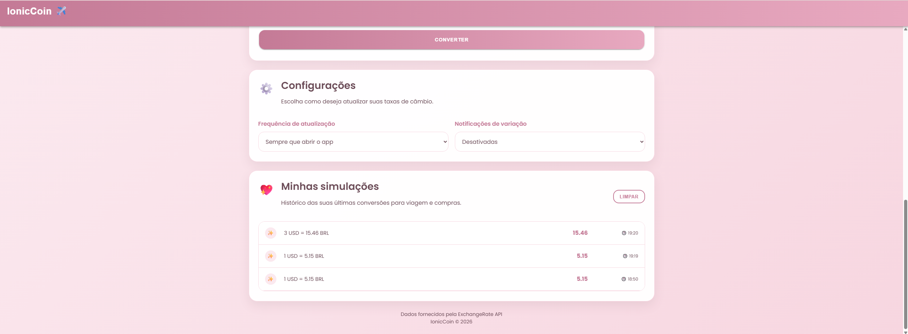

# ✈️ IonicCoin

💅 Um conversor de moedas desenvolvido com Ionic + Angular para ajudar viajantes e pessoas que fazem compras internacionais a descobrir rapidamente quanto seu dinheiro vale em diferentes países.

---

## 📖 Sobre o Projeto

O IonicCoin é um aplicativo de conversão de moedas em tempo real que utiliza a ExchangeRate API para obter taxas atualizadas.

O projeto foi desenvolvido como atividade acadêmica da disciplina de Desenvolvimento Mobile utilizando o framework Ionic.

Além da conversão tradicional, o aplicativo possui funcionalidades voltadas para viagens internacionais, incluindo seleção de destinos, pesquisa de moedas, histórico de conversões, funcionamento offline e preferências de atualização das taxas.

---

## 🚀 Funcionalidades

- Conversão de moedas em tempo real
- Modo Viagem com seleção de destinos
- Pesquisa de moedas por nome ou sigla
- Exibição de bandeiras dos países
- Histórico de conversões
- Armazenamento local utilizando LocalStorage
- Funcionamento offline utilizando a última taxa salva
- Inversão rápida entre moedas
- Interface responsiva para dispositivos móveis
- Configurações de atualização das taxas

---

## 🌎 Moedas Disponíveis

- USD — Dólar Americano
- BRL — Real Brasileiro
- EUR — Euro
- GBP — Libra Esterlina
- JPY — Iene Japonês
- CAD — Dólar Canadense
- AUD — Dólar Australiano
- CHF — Franco Suíço
- CNY — Yuan Chinês
- ARS — Peso Argentino
- MXN — Peso Mexicano
- KRW — Won Sul-Coreano
- SGD — Dólar de Singapura
- THB — Baht Tailandês
- VND — Dong Vietnamita
- INR — Rúpia Indiana
- NZD — Dólar Neozelandês
- AED — Dirham dos Emirados Árabes
- QAR — Rial Catariano
- SAR — Rial Saudita
- ZAR — Rand Sul-Africano

---

## 🛠 Tecnologias Utilizadas

- Ionic Framework
- Angular
- TypeScript
- HTML
- SCSS
- ExchangeRate API
- Browser LocalStorage
- ExchangeRate API

---

## 📦 Instalação

Clone o repositório:

```bash
git clone https://github.com/IasmimBurgos/IonicCoin.git
```

Entre na pasta:

```bash
cd IonicCoin
```

Instale as dependências:

```bash
npm install
```

Execute o projeto:

```bash
ionic serve
```

---

## 🔌 API Utilizada

ExchangeRate API

https://open.er-api.com

Responsável por fornecer as taxas de câmbio atualizadas utilizadas nas conversões.

---

## 📱 Capturas de Tela

### Tela Principal


### Modo Viagem


### Histórico de Conversões



---

## 📄 Licença

Este projeto está licenciado sob a licença MIT.

Consulte o arquivo LICENSE para mais informações.

---

## 👩‍💻 Desenvolvedora

Iasmim Burgos

Projeto desenvolvido para fins acadêmicos utilizando Ionic Framework.